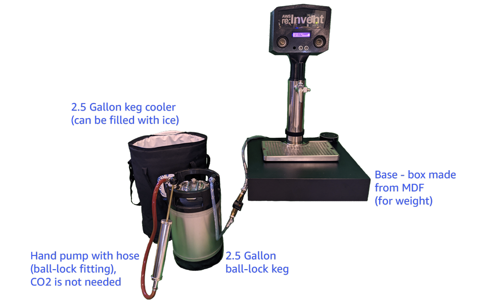

# AWS Simple Beer Service - Travel Edition

## Simple Beer Service

The SBS Travel Edition is based on Simple Beer Service, more details can be found here:

Start here, blog post: https://aws.amazon.com/blogs/startups/internet-of-beer-introducing-simple-beer-service/

* GitHub repo: https://github.com/awslabs/simplebeerservice
* Currently connected SBS units: https://simplebeerservice.com/

## SBS Travel Edition Description

Here is a description of the key differences between a full sized SBS unit, and the SBS Travel Edition.

Setup video (on Broadcast) from a conference

This shows how to setup an SBS (Simple Beer Service) Travel Edition, that I called, at the time, the Caffeine Delivery Service. Rather than having to ship an entire kegerator from event to event, SBS Travel Edition can fit in to a suitcase, and be setup in about 15 minutes.

Video_preview.png
Base construction

The key component of the SBS Travel Edition, is the base (the box). It is constructed out of 3/4" MDF to make it heavy and increase the stability. There are holes on the top for the tap tower, and on the bottom for the setup process. The back is open, which provides more access and storing wires and extra tubing out of the way.

Each piece that you need to cut is in the cut list is below. You will need the proper tools (not mentioned here) and the ability to use those tools to cut and assemble the base. The base is made out of MDF, to make it heavy. MDF is easy to work with and paints easily.

sbs_travel_edition_base.png
MDF cut list
Item 	Dimensions (inches)
Top and bottom (see below for hole size and location) 	17 x 17
Both sides 	16.25 x 2.25
Front 	17 x 2.25

For the top, you will need to cut a hole for the tap tower. After you cut the hole for the tap tower, place the tower where you want it, and then mark and drill holes for the screws to hold the tower. For the bottom, you need an access hole to be able to move the flow meter around and space for attaching the tap tower.

SBS_Travel_Edition_base_top_bottom_measurements.png
Base Assembly

See diagram above, use wood glue and finishing nails to hold in place. Let dry for 30-60 mins, patch the nail holes, and paint (3 coats).
Bill of Materials

As part of the SBS Travel Edition, you will need to build the SBS Head Unit. Follow the instructions on the SBS site: https://github.com/awslabs/simplebeerservice, but do not purchase the kegerator.

This is an updated, and modified SBS bill of materials. There are specific items to the SBS Travel Edition that are not required for a full size SBS unit.
Item 	Cost (estimate) 	Link
Keg Cooler for 2.5 gallon Keg 	$30 	https://www.amazon.com/Cool-Brewing-Gallon-Cornelius-Cooler/dp/B01L7PBEHY
2.5 Gallon Keg (Ball-Lock) 	$100 	https://www.amazon.com/2-5-Gallon-Homebrew-Keg-Stainless/dp/B01HK3DORA
Kegco Single Faucet Stainless Draft Beer Tower with Per Lick Stainless Faucet 	$150 	https://www.amazon.com/Kegco-BF-1FT650SS-Single-Stainless/dp/B0118XOE04
Drip Tray 	$40 	https://www.amazon.com/gp/product/B01EGPFVBM
3D Printed case (5 STL files) 	$250 	http://www.3dhubs.com
Raspberry Pi 4 	$105 	https://www.amazon.com/gp/product/B07TC2BK1X
GrovePi+ Starter Kit 	$109 	https://www.amazon.com/gp/product/B01BRCEWV2
Mounting and standoff screws (optional) 	$12 	https://www.amazon.com/Hilitchi-360pcs-Female-Standoff-Assortment/dp/B015S27EG2
Liquid flow meter 	$15 	https://www.adafruit.com/product/828
Micro Stereo Amplifier Amplify Board with Speakers 	$63 	https://www.amazon.com/DROK-Portable-Amplifier-Digital-Amplify/dp/B010FB89ME
Wall adapter power supply 	$7 	https://us.amazon.com/gp/product/B010FAQQNY
PlexiGlass Sheet 	$15 	https://www.amazon.com/Source-Premium-Acrylic-PlexiGlass-S1-12x12-25/dp/B00844SOSE
Audio cable 	$8 	https://www.amazon.com/AmazonBasics-3-5mm-Stereo-Audio-Cable/dp/B00NO73MUQ
Echo dot 	$30 	https://www.amazon.com/Echo-Dot/dp/B07FZ8S74R
Stainless Steel 1/2 FPT X 3/8 Hose Barb 	2 x $12 	https://www.amazon.com/gp/product/B07GR9VDWW
10 Feet - 3/8" ID 1/2" OD Clear Vinyl Food Grade Tube for Beer Line 	$11 	https://www.amazon.com/50-ID-OD-Vinyl-Tubing/dp/B01LWSPRCG
Pipe tape 	$7 	https://www.amazon.com/Everflow-811-Thread-Plumbers-White/dp/B079SYCRYG
Pipe clamps 	$13 	https://www.amazon.com/YDS-Grade-Stainless-Diameter-Bandwidth/dp/B077SQX12Y
Screws to attach back plate 	$10 	https://www.amazon.com/Stainless-Phillips-Coated-Bolt-Dropper/dp/B07D1LKFB7
Screws to hold down tap tower 	$5 	https://www.homedepot.com/p/Everbilt-10-24-x-1-1-2-in-Phillips-Flat-Head-Stainless-Steel-Machine-Screw-3-Pack-814691/204274836
Wingnuts to hold down tap tower 	 $5 	https://www.homedepot.com/p/Everbilt-10-24-Stainless-Steel-Wing-Nut-800191/204274208
Anti slip pads for bottom of base 	$5 	https://www.amazon.com/Shepherd-Hardware-9644-Surface-Furniture/dp/B00KYJN0JA
3/4 x 24 x 48 in MDF Board 	$30 	https://www.homedepot.com/p/Handprint-Medium-Density-Fiberboard-Common-3-4-in-x-2-ft-x-4-ft-Actual-0-734-in-x-23-75-in-x-47-75-in-219743/202093815
Satin Black Enamel Spray Paint 	$6 	https://www.amazon.com/Rust-Oleum-245197-Spray-Paint-12-Ounce/dp/B0016HM4DM
Amazon Fire Tablet (display SBS web page) 	$80 - $150 	https://www.amazon.com/s?k=fire+tablet
Large suitcase (needs to be 28 x 17 x 12) 	$150 - $200 	https://www.amazon.com/SwissGear-Travel-Spinner-Luggage-inches/dp/B014TFWDSS
Building the SBS Travel Edition
Initial build

    Start by building the base (instructions above). The base is needed to start assembling the SBS Travel Edition, so the base will need to be done first.
    Build the SBS Head Unit and test the sensors, following the instructions on the SBS GitHub page.
    The tap tower comes with a beverage tube already connected to the tap, you will need to install the flow meter in-line, and attach a ball-lock fitting (so you can connect it to the 2.5 gallon keg).

    Flow meter and ball-lock fitting
    SBS-Travel_flow_meter_ball-lock-fitting.png
    One important difference between the full sized SBS unit and the SBS Travel Edition, is that the SBS Head Unit needs to be able to completely separate from the tap tower. To solve this I used telephone couplers, and spliced the telephone wire with the Grove connecting wires.

    Telephone connector
    SBS_Travel_Edition_connector.png

Setup and assembly during events

    Start by mounting the tap tower to the base with wingnuts, making sure to route the beverage tube with the flow meter out the back of the base (pic above shows tube out the back).

    Use wingnuts to hold tower
    SBS_Travel_Edition_wingnuts.jpeg
    Connect sensors to the SBS Head Unit
    Install the Head Unit on to the tap tower
    Make sure the lid on the keg is closed and secure, and it is full of beer, coffee, or whatever.
    Connect the beverage tube from the tap to the "OUT" connection on the keg.
    Attach the hand pump to the keg "IN" connection. If it is not pressurized, use the hand pump about 8 times.
    Verify liquid is flowing from the tap.
    Plug in the SBS Head Unit and the Alexa device in to a power source.
    Verify the unit is on the SBS web page, and check that all of the sensors are working.

Packing in a suitcase

This picture shows everything in the suitcase (the base is below the tower and Head Unit), you will need to stuff padding (e.g., towels) to protect everything. The suitcase is approximately 28 x 17 x 12 inches.

SBS Travel Edition packed up
SBS_Travel_Edition_suitcase.png
